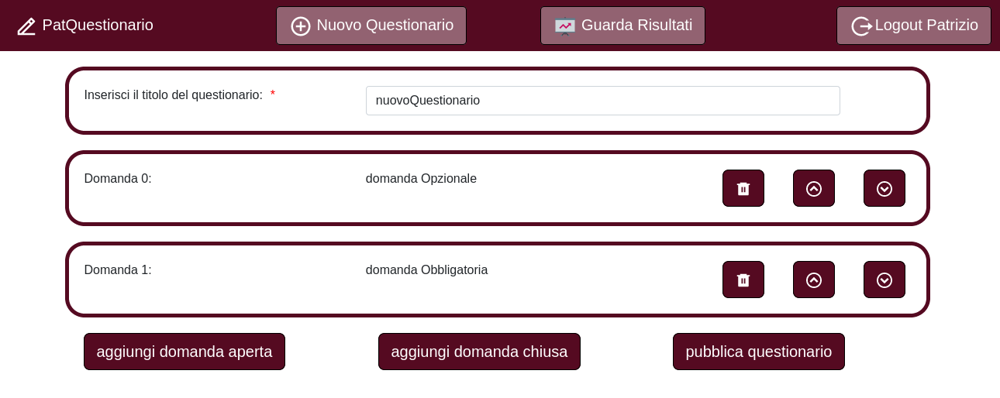

# Exam #1: "Exam Questionario"
## Student: s292497 DE GIROLAMO PATRIZIO 

## React Client Application Routes

- Route `/questionari`: Home page per gli users. Mostra una tabella con tutti i questionari creati e per ogni riga è presente un bottone che serve per compilare il questionario selezionato. Questa route è accessibile solo dagli users non loggati. Se un admin cerca di indirizzare questa pagina, una redirect lo reindirizza alla home page per gli admin.

- Route `/questionari/:idQuest`: pagina che serve per compilare il questionario con ID=<idQuest>. Viene mostrata la lista di domande e le relative possibili risposte. Questa route è accessibile solo dagli users non loggati. Se un admin cerca di indirizzare questa pagina, una redirect lo reindirizza alla home page per gli admin. *idQuest* è l'id univoco del questionario che lo user vuole compilare.
  
- Route `/view/questionari`: Home page per gli admins. Mostra una tabella con tutti i questionari creati dall' admin che è loggato in quel momento. Per ogni riga è presente un bottone che serve per analizzare le compilazioni che i vari utenti hanno fatto. Questa route è accessibile solo dagli admins. Se uno user cerca di indirizzare questa pagina, una redirect lo reindirizza alla home page per gli users.
  
- Route `/view/questionari/:idQuest`: Visualizza per ogni utente selezionato le sue risposte inerenti al questionario con ID = <idQuest>.
 *idQuest* è l'id univoco del questionario di cui si vogliono analizzare le compilazioni. Questa route è accessibile solo dagli admins. Se uno user cerca di indirizzare questa pagina, una redirect lo reindirizza alla home page per gli users.
   
- Route `/add/questionari`: Visualizza il form per inserire un nuovo questionario.Questa route è accessibile solo dagli admins. Se uno user cerca di indirizzare questa pagina, una redirect lo reindirizza alla home page per gli users.

## API Server
  
- GET `/api/questionari`
  - *descrizione*: ritorna la lista di tutti i questionari presenti nel db.
  - *response body content*: array di oggetti con il seguente formato.
       
  
  [{ "idQuest": 113,
    "titolo": "Europei Azzurri 2021", 
    "creatorId": 0,
    "nome": "Patrizio"
    ]}
     

- GET `/api/compilazioni`
  - *descrizione*: ritorna la lista di tutte le compilazioni di ogni questionario presenti nel db.
  - *response body content*: array di oggetti con il seguente formato.
    
  [{ "idComp": 0,
      "idDom: 0,
      "idQuest": 113,
      "risp": Array [ "Sempre" ],
      "utilizzatore": "pattidegi",
  
  
- GET `/api/domande`
  - *descrizione*: ritorna la lista di tutte le domande di ogni questionario presenti nel db.
  - *response body content*: oggetto con il seguente formato.
      
   { "idDom": 0,
      "idQuest": 113,
      "max": 1,
      "min": 1,
      "pos": 0,
      "quesito": "Segui le partite dell' Italia in questo europeo?",
      "risposte: Array(4) [ "Sempre", "Spesso", "Non molto", "No" ],
      "tipo": 1
  }
    
  
- POST `/api/questionari`
  - *descrizione*: inserisce nel db un nuovo questionario. Puo' essere chiamata solo da un admin.
  - *response body content*: array di oggetti con il seguente formato.
      
      {"creatorId": 0,
        "domande": Array [ { "idDom": 0,
                              "max": -1,
                              "min": 0,
                              "pos": 0,
                              "quesito": "domandaAperta",
                              "risposte": null,
                              "tipo": 0  }, 
                           {  "idDom": 1,
                              "max": 3
                              "min": 2
                              "pos": 1
                              "quesito": "DomandaChiusa",
                              "risposte": Array(3) [ "risp1", "risp2", "risp3" ]
                              "tipo": 1  } ],
        "nome": "Patrizio",
        "titolo": "nuovoQuestionario"
      }
      
  - *response body*: 
    
     response 200 OK: "Questionario inserito correttamente"
     response 400 Bad request: "parametri invalidi"
     response 500: "Errori che si verificano quando inserisci male un questionario nel db"
    
  
- POST `/api/compilazioni`
  - *descrizione*: inserisce nel db una nuova compilazione. Puo' essere chiamata solo da uno user.
  - *response body content*: oggetto con il seguente formato.
  
      
    { "idQuest": 114,
      "utilizzatore": "NuovoUser", 
      "arrayRisposte": Array(5) [ {"idDom": 0,
                                    "risp": Array [ "Indie", "Rock" ]},
  
                                  {"idQuest": 114, 
                                   "idDom": 1,
                                   "risp": "The Lumineers" },
  
                                  ecc...
                                 ]
    }
  
- *response body*: 
    
     response 200 OK: "Compilazioni inserite correttamente"
     response 400 Bad request: "parametri invalidi"
     response 500: "Errori che si verificano quando inserisci male una compilazione nel db"
    

- POST `/api/sessions`
  - *description*:  autentica lo user che sta cercando di effettuare il login
  - *request body*:
       
      { "username": "patrizio@polito.it", "password": "pattidegi" }
      
  - *response body*: 
      
     { "id": 0, "email": "patrizio@polito.it", "nome": "Patrizio" }
     
- DELETE `/api/sessions/current`
   - *description*: logout user corrente
   - *request body*: Nessuna
   - *response body*: Nessuna
  
- GET `/sessions/current`
   - *description*: controlla se lo user corrente è loggato e fai una get dei suoi dati
   - *request body*: Nessuna
   - *response body*: Nessuna 
  
  
## Database Tables

## Database Tables

- Table `ADMINS` - contiene [id,email,hash,nome] di ogni admin
- Table `QUESTIONARI` - contiene [idQuest, titolo, creatorId, nome] di ogni questionario
- Table `DOMANDE` - contiene [idQuest, idDom, quesito, tipo, pos, min, max, risposte ] per ogni domanda
- Table `RISPOSTEUSER` - contiene [idQuest, idDom, risp, utilizzatore, idComp].  

## Main React Components

- `AggiungiQuestionario` (in `AggiungiQuestionario.js`): è un form che permette di inserire un nuovo questionario. Presenta due bottoni per inserire rispettivamente una domanda aperto o chiusa e un bottone per pubblicare il questionario.
  
- `AggiungiDomandaAperta` (in `AggiungiQuestionario.js`): è un modal che permette di inserire una domanda aperta e permette di scegliere la tipologia: "obbligatoria o opzionale" grazie a due checkboxes
  
- `AggiungiDomandaChiusa` (in `AggiungiQuestionario.js`): è un modal che permette di inserire una domanda Chiusa. Permette di inserire fino a 10 possibili risposte e dopo permette di inserire il numero minimo o massimo di risposte grazie a due form.
  
- `DomandaAperta` (in `DomandaAperta.js`): permette di visualizzare una domanda aperta e se in modalità scrittura permette di inserire correttamente i dati. 
- `DomandaChiusa` (in `DomandaChiusa.js`): permette di visualizzare una domanda chiusa se in modalità scrittura permette di inserire correttamente i dati. 
  
- `GuardaRisultati` (in `GuardaRisultati.js`): Renderizza una tabella contenente tutti i questionari creati dall'admin corrente.  Permette di visualizzare il numero di tutte le compilazioni di un determinato questionario. 
  
- `MyCompilaQuestionario` (in `MyCompilaQuestionario.js`): permette di compilare correttamente un questionario. Si serve di "DomandaChiusa" e "DomandaAperta" in modalità scrittura. Quando si avrà completato la compilazione si può inviare il questionario compilato tramite il pulsante di "invia"
  
- `MyModalLogin` (in `MyModalLogin.js`): E' un modal che permette di eseguire il login. Email e password vengono conservati in due stati e quando si schiaccia sul bottone di submit viene controllata la validità dei dati sia lato client sia lato server.
  
- `MyNavbar` (in `MyModalLogin.js`): è componente che in base allo stato "loggedAdmin" renderizza componenti diversi. In particolare se loggedAdmin == null -> renderizza il bottone di login altimenti
renderizza il bottone di logout e i due bottono per le funzionalità da Admin.
  
- `MyQuestionarioScegli` (in `GreatButton.js`): Quando si è loggati, viene usato questo componente per renderizzare una tabella con tutti i propri questionari. Serve per scegliere quale questionario andare ad analizzare.
  
- `MyVisualizzaQuestionario` (in `GreatButton.js`): -  permette di visualizzare tutte le compilazioni di un determinato questionario. Si serve di due bottoni: Precedente e Successivo per scorrere i vari user che hanno compilato il questionario

## Screenshot

## Users Credentials

| Username     | Password   |  Titoli questionari |
| :-----    | :-----   | :----- |
| patrizio@polito.it          | pattidegi   |"Europei Azzurri 2021", "Valutazione PatQuestionario"|
| federica@unito.it       | federica | "Gusti Musicali"|
